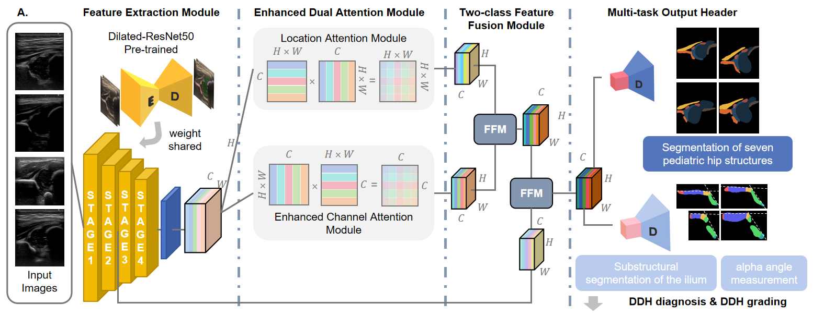

# DeepDDH: Deep Learning-Based DDH Diagnostic System

## Overview

DeepDDH is a deep learning system designed for automated **Developmental Dysplasia of the Hip (DDH)** diagnosis using ultrasound images. It integrates anatomical segmentation, quality assurance, and diagnostic decision support to provide standardized Graf-based grading, enabling accurate and consistent hip joint assessment.

## System Architecture

The DeepDDH system adopts a modular design with three core components:

### 1. Backbone & Attention Module

* **Backbone**: Dilated-ResNet50 (enhanced spatial resolution preservation for medical imaging)

* **Attention Module**: Refines feature representation by focusing on clinically relevant regions

### 2. Task-Specific Output Heads

| Head Name                  | Abbreviation | Task Description                                                                                                                                                  |
| -------------------------- | ------------ | ----------------------------------------------------------------------------------------------------------------------------------------------------------------- |
| Structure Output Header    | SOH          | 7-class anatomical segmentation: 1. Hip joint capsule; 2. Femoral head; 3. Chondro-osseous border; 4. Labrum; 5. Cartilaginous roof; 6. Bony roof; 7. Bony rim.   |
| Key Landmark Output Header | KLOH         | 6-substructural segmentation of the ilium (localizes 5 critical reference points)                                                                                 |

### 3. Sequential Functional Modules

The system operates in two sequential stages to ensure diagnostic reliability:

## 1. Quality Assurance (QA) Module

The QA module validates image quality against Graf-standardized criteria via two checklists:

### Checklist 1: Anatomical Identification

Verifies presence and accuracy of 8 key anatomical structures from SOH output:

1. Chondro-osseous border

2. Femoral head

3. Synovial fold

4. Joint capsule

5. Labrum

6. Cartilaginous roof

7. Bony roof

8. Bony rim (concavity-convexity)

### Checklist 2: Imaging Standard Compliance

Uses 5 reference points localized by KLOH to validate imaging protocol adherence:

#### Reference Points Localized by KLOH:

* Bony roof (left)

* Bony roof (right)

* Bony acetabular roof

* Turning point of the bony rim

* Lower limb-plane

#### Validation Criteria:

1. Iliac parallelism: Line connecting left/right bony-roof points is parallel to transducer axis

2. Labrum visibility: Labrum is properly captured in SOH segmentation mask

3. Limb-plane presence: Inferior limb-plane is clearly depicted

## 2. Diagnostic Decision Support Module

After passing QA, the system automatically computes Graf angles and classifies DDH severity:

### Step 1: Construct Graf Reference Lines

Using SOH mask and KLOH-localized landmarks, three core reference lines are generated:

| Reference Line      | Definition                                                 |
| ------------------- | ---------------------------------------------------------- |
| Bony Roof Line      | Connects left and right bony-roof points                   |
| Base Line           | Connects bony rim turning point and lower limb-plane point |
| Cartilage Roof Line | Connects centroid of the labrum and bony rim turning point |

### Step 2: Angle Calculation & Classification

Computes α-angle (bone coverage) and β-angle (cartilage coverage) from reference lines, then outputs DDH grading based on Graf standards.

## Training Strategy

DeepDDH employs a **two-stage training paradigm** to balance segmentation accuracy and diagnostic performance:

### Stage 1: Coarse Structural Feature Learning

* Training Data: Annotated images of 7 anatomical structures (SOH targets)

* Optimization Targets: Feature extraction network + SOH

* Outcome: Coarse-grained anatomical segmentation (global structure identification)

### Stage 2: Fine-Grained Joint Optimization

* Training Data: Annotated images of 7 anatomical structures + 6 iliac substructures

* Optimization Targets: Feature extraction network + SOH + KLOH

* Outcome: Refined segmentation outputs (supports accurate landmark localization and angle calculation)

### Final Output

From optimized segmentation results, the system automatically executes:

1. Quality assurance validation

2. Graf reference line construction

3. α/β angle computation

4. DDH grading

## Key Features

* **Automated Segmentation**: End-to-end 7-class anatomical + 6-substructural segmentation

* **Standardized QA**: Graf-compliant checklist validation for image quality control

* **Objective Diagnosis**: Eliminates inter-observer variability in angle measurement

* **Clinical Alignment**: Directly maps to clinical Graf's grading workflow

## Citation
Liu, R., Zhang, Y., Luo, X., Zheng, Y., Liu, Q., Liu, M., & Jiang, L. (2025). QualityDDH: visualized standardization of neonatal hip ultrasound via a structural prior regression framework. Visual Computer, 41(13), 11589–11602. [https://doi.org/10.1007/s00371-025-04121-2]
Liu, M., Liu, R., Shu, J., Liu, Q., Zhang, Y., & Jiang, L. (2025). AutoDDH: A dual-attention multi-task network for grading developmental dysplasia of the hip in ultrasound images. *Visual Computer*, *41*(10), 7013–7025. [https://doi.org/10.1007/s00371-024-03789-2](https://doi.org/10.1007/s00371-024-03789-2)
Liu, R., Liu, M., Sheng, B., Li, H., Li, P., Song, H., Zhang, P., Jiang, L., & Shen, D. (2021). NHBS-Net: A feature fusion attention network for ultrasound neonatal hip bone segmentation. IEEE Transactions on Medical Imaging, 40(12), 3446–3458. [https://doi.org/10.1109/TMI.2021.3087857]

