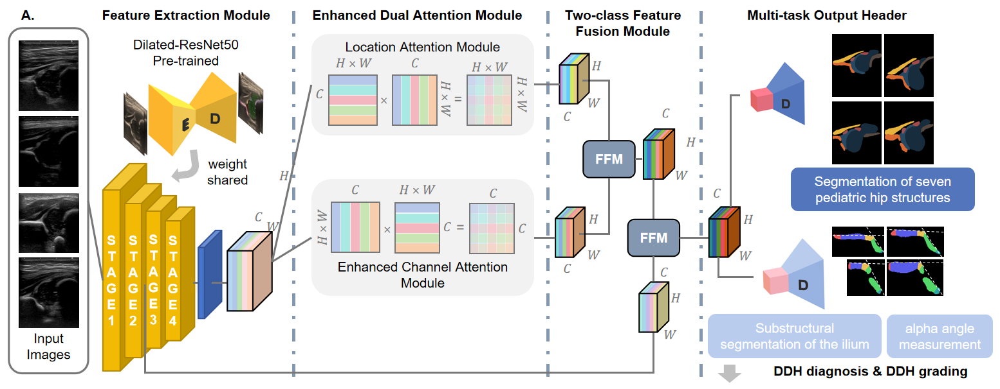

# DeepDDH: Deep Learning-Based DDH Diagnostic System

## Overview

DeepDDH is a deep learning system designed for automated **Developmental Dysplasia of the Hip (DDH)** diagnosis using ultrasound images. It integrates anatomical segmentation, quality assurance, and diagnostic decision support to provide standardized Graf-based grading, enabling accurate and consistent hip joint assessment.

## System Architecture

The DeepDDH system adopts a modular design with three core components:


## Pipeline overview

| Step | Script | Input | Output |
| --- | --- | --- | --- |
| STEP1 | `scripts/STEP1_pretrain_PreD.py` | Ultrasound images + 8-class anatomical masks | Anatomical segmentation checkpoint |
| STEP2 | `scripts/STEP2_train_Det_bony.py` | STEP1 checkpoint + anatomical masks + 7-class bony masks | Multi-task Stage-2 checkpoint |
| STEP3 | `scripts/STEP3_generate_DeepDDH_seg_masks.py` | Unseen images + Stage-2 checkpoint | Anatomical and bony class maps |
| STEP4 | `scripts/STEP4_cal_alpha_based_on_seg_masks.py` | Paired STEP3 class maps | Five bony landmarks, labrum centroid, and angle JSON/CSV |

The model uses a dilated ResNet-50 encoder, channel/spatial attention, feature fusion, coordinate-aware output heads, and bilinear upsampling.

### STEP1: anatomical representation learning

STEP1 trains an 8-channel output head: background plus seven foreground anatomical structures. Its default DeepDDH backbone is `dilated_ddhnet`; comparison models are also available from the same entry point.

### STEP2: multi-task refinement

STEP2 initializes compatible shared layers from STEP1 and trains `DDHNet_Bony` with two outputs:

- an 8-class anatomical segmentation map;
- a 7-class bony/iliac-substructure map (background plus six foreground classes).

### STEP3: segmentation-map generation

STEP3 loads the plain `state_dict` produced by STEP2, performs batched inference, and saves one PNG per input image for each output head. Raw class-ID maps are the recommended format. The legacy `class_id × 30` grayscale format remains available for compatibility.

### STEP4: quality gating, landmarks, angles, and Graf classification

STEP4 performs deterministic post-processing; it does not run another neural network. It:

1. checks that all seven foreground classes are present in the 8-class anatomical map (background + seven anatomical structures);
2. checks that all six foreground classes are present in the 7-class bony map (background + six iliac substructures);
3. extracts the bony upper edge, obtains five bony landmarks, and calculates the parallel angle;
4. classifies the image as **standard** only when both class-presence checks pass and the parallel angle is within ±5°; otherwise it is **non-standard**;
5. calculates α and β angles and, for standard images, applies the grouped Graf rules described below;
6. writes per-case JSON and CSV records including the three quality checks, angle measurements, and Graf output.

This quality gate follows the released DeepDDH workflow: failure of any one of the three checks results in a non-standard image, and non-standard images do not proceed to the final Graf classification.

The implemented bony-label-to-landmark mapping is:

```text
bony class 2 -> K0
bony class 3 -> K1
bony class 4 -> K2
bony class 6 -> K3
bony class 5 -> K4
```

For line angle `angle(P, Q)` in degrees, STEP4 calculates:

```text
parallel = -angle(K0, K1)
alpha    =  angle(K2, K3) - parallel
beta     = -angle(K4, labrum_centroid) + parallel
```

### Grouped Graf rules used in STEP4

STEP4 calculates alpha angle. The grouped classification table supplied for this release defines the following categories from alpha angle and infant age:

| Graf DDH type | alpha angle | Age | Description |
| --- | --- | --- | --- |
| Type I | ≥60° | Any age | Mature hip |
| Type IIa | ≥50° and <60° | ≤90 days | Mild dysplasia |
| Type IIb | ≥50° and <60° | >90 days | Mild dysplasia |
| Type IIc / Type D | ≥43° and <50° | Any age | Severe dysplasia |
| Type III / Type IV | <43° | Any age | Dislocation |

The implementation operationalises three months as 90 days, consistent with the study analysis rules. β angle is retained in the output. Because the supplied grouped table does not specify β-angle thresholds for separating **IIc from D** or **III from IV**, STEP4 reports these as grouped categories rather than inventing unsupported finer cut-offs. If age is unavailable for an α angle between 50° and 60°, the output is `Type IIa/IIb` until age is supplied.

This label mapping is dataset-specific. Confirm it against the annotation protocol before applying STEP4 to a newly encoded dataset.

## Repository layout

```text
.
├── scripts/
│   ├── STEP1_pretrain_PreD.py
│   ├── STEP2_train_Det_bony.py
│   ├── STEP3_generate_DeepDDH_seg_masks.py
│   └── STEP4_cal_alpha_based_on_seg_masks.py
├── ddhnet_model/                     # DeepDDH and DDHNet_Bony definitions
├── model/                            # comparison segmentation models
├── attention/                        # attention and feature-fusion modules
├── utils/                            # datasets, losses, metrics, inference loader
├── data/
│   ├── README.md                     # detailed data placement instructions
│   ├── Training/                     # empty placeholders
│   ├── Testing/                      # empty placeholders
│   └── Ext-1/ ... Ext-8/             # empty optional external-set placeholders
├── checkpoint/                       # generated by STEP1/STEP2; Git-ignored
├── outputs/                          # generated by STEP3/STEP4; Git-ignored
├── requirements.txt
├── .gitignore
└── DeepDDH_model_figure.png
```

All four entry points derive the project root from their own file location. They can therefore be called with `python scripts/<script>.py` without moving scripts back to the repository root.

## Environment setup

### Recommended platform

- Python 3.10 or newer
- PyTorch 2.0 or newer
- An NVIDIA CUDA-capable GPU for practical 512 × 512 training
- CPU inference is supported by the released DeepDDH coordinate heads, but it is substantially slower

Create and activate an environment:

```bash
python -m venv .venv

# Linux/macOS
source .venv/bin/activate

# Windows PowerShell
# .\.venv\Scripts\Activate.ps1

python -m pip install --upgrade pip
```

Install a PyTorch build suitable for the operating system and GPU using the [official PyTorch installation selector](https://pytorch.org/get-started/locally/). Then install the declared dependencies:

```bash
python -m pip install -r requirements.txt
```

The declared requirements cover the four STEP1–STEP4 entry points. The optional utilities `data/ana_masks.py` and `data/check_all_img_and_mask.py` additionally require:

```bash
python -m pip install opencv-python pandas
```

The custom CUDA focal-loss extension under `attention/seg_opr/sigmoid_focal_loss/` is not used by STEP1–STEP4 and does not need to be compiled.

### ImageNet initialization

STEP1 and STEP2 construct their ResNet-50 backbone with ImageNet initialization. On first use, PyTorch downloads `resnet50-19c8e357.pth` into the Torch Hub cache. An internet connection is required unless the file is already available under:

```text
${TORCH_HOME}/hub/checkpoints/resnet50-19c8e357.pth
```

STEP3 sets `pretrained_model=False` because it immediately loads the complete trained Stage-2 checkpoint; it does not need to download ImageNet weights.

## Data preparation

No image or label is distributed. Populate the existing directories as follows:

```text
data/
├── Training/
│   ├── imgs/<case_id>.png
│   ├── segs/<case_id>.png
│   └── bony_masks/<case_id>.png
└── Testing/
    ├── imgs/<case_id>.png
    ├── segs/<case_id>.png
    └── bony_masks/<case_id>.png
```

Requirements:

- Each case must have the same filename stem in all required directories.
- STEP1 requires `imgs` and `segs`; STEP2 requires all three files.
- Training images are expected to be RGB PNG files.
- Masks are integer class-index images, not one-hot tensors or 0/255 binary masks.
- `segs` values must be 0–7; `bony_masks` values must be 0–6.
- Images and their masks must have identical spatial dimensions.
- Grayscale masks are preferred. The training loaders use the first channel if a mask is RGB.

The foreground anatomical targets are the hip joint capsule, femoral head, chondro-osseous border, labrum, cartilaginous roof, bony roof, and bony rim. The training source code does not itself store a reliable semantic name for every numeric foreground ID. STEP4 therefore exposes `--labrum-class` and defaults it to 5, matching the supplied post-processing implementation.

The private data snapshot for which the original code paths were configured used 6,749 training cases and 761 validation cases at 512 × 512 pixels. These files are not part of this repository.

## Reproduction commands

Run the following commands from the repository root. Paths passed explicitly on the command line may be absolute or relative to the project root in STEP1/STEP2.

### 1. Train STEP1

The complete default three-seed configuration is:

```bash
python scripts/STEP1_pretrain_PreD.py --model-name dilated_ddhnet --n-classes 8 --epochs 100 --batch-sizes 16 --lr 1e-5 --scale 1.0 --seeds 2026 2027 2028 --patience 10 --min-delta 0.001 --monitor-metric val_loss --num-workers-train 8 --num-workers-val 4 --base-path ./checkpoint/Stage-1
```

The equivalent short command is:

```bash
python scripts/STEP1_pretrain_PreD.py
```

STEP1 uses RMSprop, cross-entropy plus focal loss, `ReduceLROnPlateau`, gradient-value clipping, deterministic seed setup, early stopping, and background-excluded dataset-level Dice reporting.

Supported `--model-name` values are `dilated_ddhnet`, `ddhnet`, `danet_ddhnet`, `unet`, `segnet`, `fcn`, `aunet`, `danet`, `bisenet`, and `scse`.

Default output:

```text
checkpoint/Stage-1/<model_name>/bs_<batch_size>/seed_<seed>/
```

### 2. Train STEP2

Use the matching STEP1 best checkpoint for each seed and batch size:

```bash
python scripts/STEP2_train_Det_bony.py --n-classes 8 --bony-class 7 --epochs 100 --batch-sizes 16 --lr 1e-5 --scale 1.0 --seeds 2026 2027 2028 --patience 10 --min-delta 1e-5 --monitor-metric val_total_loss --load-template "./checkpoint/Stage-1/dilated_ddhnet/bs_{batch_size}/seed_{seed}/checkpoints/best_model.pth" --num-workers-train 8 --num-workers-val 4 --base-path ./checkpoint/Stage-2
```

`--load-template` substitutes `{batch_size}` and `{seed}`. A single checkpoint can instead be supplied with `--load`. If neither option is present, STEP2 starts from ImageNet initialization and is no longer the intended two-stage protocol.

The default STEP2 objective is:

```text
L_total = L_seg + L_bony
L_seg   = CE_seg + Focal_seg + 0.1 × CentroidMSE_seg
L_bony  = CE_bony + Focal_bony
```

Pass `--use-bony-centroid-loss` to add the bony centroid term. The best model is selected by total validation loss by default.

Default output:

```text
checkpoint/Stage-2/ddhnet_bony/bs_<batch_size>/seed_<seed>/
```

### 3. Generate segmentation maps with STEP3

Place inference images in any directory and supply one trained STEP2 checkpoint:

```bash
python scripts/STEP3_generate_DeepDDH_seg_masks.py --input-dir ./inference_inputs --checkpoint ./checkpoint/Stage-2/ddhnet_bony/bs_4/seed_2026/checkpoints/best_model.pth --batch-size 4 --device auto
```

Default outputs:

```text
outputs/STEP3/
├── seg_masks/<case_id>.png           # class IDs 0-7
└── bony_masks/<case_id>.png          # class IDs 0-6
```

Important STEP3 options:

- `--mask-encoding class_id` is the recommended default.
- `--mask-encoding times_30` writes the legacy values 0, 30, 60, ... .
- `--normalize` divides image pixels by 255. Leave it disabled to match the current STEP2 training loader.
- `--amp` enables CUDA mixed precision.
- `--scale` resizes network input; output maps are resized back to the original image size with nearest-neighbor interpolation.
- `--overwrite` permits replacement of existing output PNGs.
- If input images have different sizes, use `--batch-size 1`.

STEP3 accepts PNG, JPEG, BMP, and TIFF image files. It processes a directory of images or extracted video frames; it does not decode a video container directly.

### 4. Calculate landmarks and angles with STEP4

With the default STEP3 output locations:

```bash
python scripts/STEP4_cal_alpha_based_on_seg_masks.py
```

An explicit invocation is:

```bash
python scripts/STEP4_cal_alpha_based_on_seg_masks.py --seg-dir ./outputs/STEP3/seg_masks --bony-dir ./outputs/STEP3/bony_masks --encoding auto --labrum-class 5 --min-labrum-pixels 20 --output-json ./outputs/STEP4/measurements.json --output-csv ./outputs/STEP4/measurements.csv
```

STEP4 requires exactly matched PNG stems between `--seg-dir` and `--bony-dir`. `--encoding auto` accepts both raw class-ID maps and the legacy `class_id × 30` maps.

The JSON file contains:

- a batch-level `quality_assessment` derived from parallel angles;
- `all_key_points`, with five bony points followed by the labrum centroid;
- `all_angles` in `[parallel, alpha, beta]` order;
- named angle fields, per-case validity `status`, and labrum pixel count.

Named unavailable angles are written as JSON `null`; the backward-compatible `all_angles`/`all_key_points` arrays use `-9999.0` as the invalid sentinel. A case status is `complete`, `parallel_only`, or `invalid`.

### Inspect command-line options

```bash
python scripts/STEP1_pretrain_PreD.py --help
python scripts/STEP2_train_Det_bony.py --help
python scripts/STEP3_generate_DeepDDH_seg_masks.py --help
python scripts/STEP4_cal_alpha_based_on_seg_masks.py --help
```

On Windows, use `--num-workers-train 0 --num-workers-val 0` for STEP1/STEP2 or `--num-workers 0` for STEP3 if multiprocessing startup causes problems.

## Training outputs

Each STEP1/STEP2 run contains:

```text
config.json
history.csv
best_metrics.json
run_summary.json
curve_*.png
checkpoints/best_model.pth
checkpoints/last_model.pth
tb/events.out.tfevents.*
```

Experiment-level `experiment_summary.csv` and `experiment_summary_stats.csv` are generated after all configured seeds finish. These runtime outputs are excluded by `.gitignore` and are not distributed in this public release.

Launch TensorBoard with:

```bash
tensorboard --logdir checkpoint
```

## Citation

If this code or its components are useful in your research, please cite the relevant work:

* Liu, R., Zhang, Y., Luo, X., Zheng, Y., Liu, Q., Liu, M., & Jiang, L. (2025). QualityDDH: visualized standardization of neonatal hip ultrasound via a structural prior regression framework. Visual Computer, 41(13), 11589–11602. https://doi.org/10.1007/s00371-025-04121-2
* Liu, M., Liu, R., Shu, J., Liu, Q., Zhang, Y., & Jiang, L. (2025). AutoDDH: A dual-attention multi-task network for grading developmental dysplasia of the hip in ultrasound images. *Visual Computer*, *41*(10), 7013–7025. https://doi.org/10.1007/s00371-024-03789-2   
* Liu, R., Liu, M., Sheng, B., Li, H., Li, P., Song, H., Zhang, P., Jiang, L., & Shen, D. (2021). NHBS-Net: A feature fusion attention network for ultrasound neonatal hip bone segmentation. IEEE Transactions on Medical Imaging, 40(12), 3446–3458. https://doi.org/10.1109/TMI.2021.3087857
